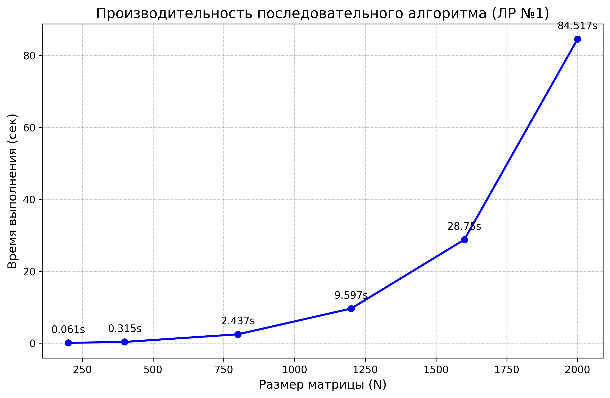

# Лабораторная работа №1: Последовательные вычисления

## 1. Постановка задачи
Целью данной работы является реализация базового алгоритма перемножения двух квадратных матриц $A$ и $B$ размерности $N \times N$. Программное решение должно обеспечивать:
* Чтение исходных данных из внешних текстовых файлов.
* Вычисление произведения матриц классическим последовательным методом.
* Фиксацию времени работы вычислительного блока.
* Сохранение результата в файл и автоматизированную верификацию корректности вычислений.

## 2. Методика реализации
Программа написана на языке C++. Для хранения матриц использованы одномерные динамические векторы (`std::vector<double>`), что позволяет эмулировать двумерный массив и обеспечивает эффективную работу с кэш-памятью процессора благодаря непрерывному расположению данных в памяти.

Для измерения времени работы использовалась стандартная библиотека `<chrono>`. Верификация результатов реализована с помощью скрипта на Python (библиотека `numpy`), который сравнивает полученную матрицу с эталонным значением методом `np.allclose`.

## 3. Анализ производительности
Эксперименты проводились для размерностей матриц от 200 до 2000. Для исключения системных погрешностей каждый тест запускался 5 раз, в таблицу занесены средние значения времени.

| Размер (N) | Число операций (~$2N^3$) | Среднее время (сек) | Верификация |
| :--- | :--- | :--- | :--- |
| **200** | $1.60 \cdot 10^7$ | 0.061 | ✅ Успешно |
| **400** | $1.28 \cdot 10^8$ | 0.315 | ✅ Успешно |
| **800** | $1.02 \cdot 10^9$ | 2.437 | ✅ Успешно |
| **1200** | $3.46 \cdot 10^9$ | 9.597 | ✅ Успешно |
| **1600** | $8.19 \cdot 10^9$ | 28.750 | ✅ Успешно |
| **2000** | $1.60 \cdot 10^{10}$ | 84.517 | ✅ Успешно |

*Примечание: общее число операций для умножения матриц N x N составляет примерно 2N^3 (N^3 умножений и N^3 сложений).*
 
## 4. Визуализация

## 5. Заключение
В ходе работы была экспериментально подтверждена кубическая зависимость времени выполнения алгоритма от размерности матриц ($O(N^3)$). При увеличении размера матрицы в 2 раза время вычислений возрастает примерно в 8 раз (например, переход от N=400 к N=800: $0.315 \times 8 \approx 2.5$ сек). 
Полученные результаты наглядно демонстрируют низкую эффективность последовательного кода на больших объемах данных (N > 1000) и обосновывают необходимость перехода к параллельным технологиям (OpenMP, MPI, CUDA).
