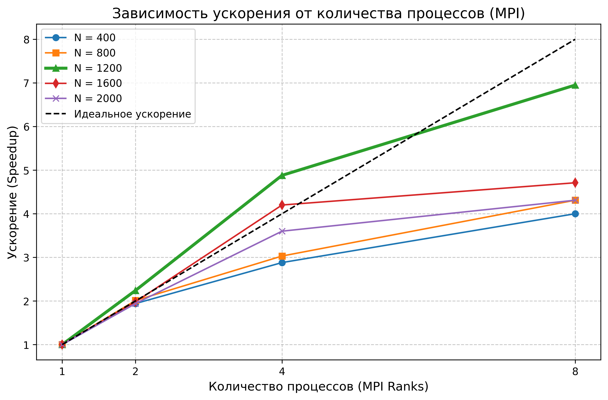

# Лабораторная работа №3. Распределенные вычисления (MPI)

## 1. Цель и задачи
Адаптировать алгоритм перемножения плотных квадратных матриц для работы на вычислительных кластерах с распределенной памятью с использованием стандарта MPI (Message Passing Interface). Исследовать масштабируемость алгоритма и сравнить поведение изолированных процессов с потоками общей памяти (из ЛР №2).

## 2. Архитектура параллельного решения
В отличие от OpenMP, в MPI процессы не имеют доступа к общей памяти, что требует явной маршрутизации данных по коммуникационной сети (в данном случае — через общую шину локального узла).

**Алгоритм маршрутизации (Scatter-Gather):**
1. **Инициализация:** Процесс с рангом `0` (Master) считывает исходные матрицы $A$ и $B$ из дисковой подсистемы.
2. **Декомпозиция:** Процесс `0` использует коллективную операцию `MPI_Scatter` для разрезания матрицы $A$ на горизонтальные полосы (по $N/p$ строк) и раздает их каждому процессу (включая себя).
3. **Широковещание:** Матрица $B$ необходима каждому процессу целиком. Для ее рассылки используется оптимизированная операция `MPI_Bcast`.
4. **Вычисления:** Каждый процесс перемножает свою локальную полосу $A_{sub}$ на матрицу $B$. Синхронизация на данном этапе не требуется.
5. **Сборка:** Операция `MPI_Gather` собирает локальные результирующие полосы $C_{sub}$ обратно в процесс `0`, который формирует итоговую матрицу $C$ и сохраняет её.

## 3. Результаты профилирования
Тестирование проводилось локально на Windows-системе (MS-MPI). В таблице представлены усредненные значения времени по результатам 3 независимых прогонов для каждого набора параметров.

| Размер (N) | Процессов (p) | Среднее время (сек) | Ускорение (S) | Эффективность (E) |
|:---|:---|:---|:---|:---|
| **400**  | 1 | 0.280 | 1.00x | 100% |
|          | 2 | 0.144 | 1.94x | 97%  |
|          | 4 | 0.097 | 2.88x | 72%  |
|          | 8 | 0.070 | 4.00x | 50%  |
| **800**  | 1 | 2.634 | 1.00x | 100% |
|          | 2 | 1.310 | 2.01x | ~100%|
|          | 4 | 0.867 | 3.03x | 75%  |
|          | 8 | 0.611 | 4.31x | 53%  |
| **1200** | 1 | 14.81 | 1.00x | 100% |
|          | 2 | 6.600 | 2.24x | 112% |
|          | 4 | 3.030 | 4.88x | 122% |
|          | 8 | 2.130 | 6.95x | 86%  |
| **1600** | 1 | 43.68 | 1.00x | 100% |
|          | 2 | 21.96 | 1.98x | 99%  |
|          | 4 | 10.38 | 4.20x | 105% |
|          | 8 | 9.260 | 4.71x | 58%  |
| **2000** | 1 | 78.03 | 1.00x | 100% |
|          | 2 | 40.10 | 1.94x | 97%  |
|          | 4 | 21.64 | 3.60x | 90%  |
|          | 8 | 18.10 | 4.31x | 53%  |

## 4. График масштабируемости

## 5. Выводы и анализ аномалий
1. **Суперлинейное ускорение (Эффекты кэширования):** На размерах $N=1200$ и $N=1600$ при переходе к 2 и 4 процессам наблюдается суперлинейное ускорение (эффективность $E > 100\%$). В отличие от потоков OpenMP, делящих общий кэш, изолированные процессы MPI работают с независимыми участками памяти. Когда матрица $A$ разбивается на 4 блока, каждый локальный блок полностью помещается в высокоскоростной кэш процессора (L2/L3), кардинально снижая количество кэш-промахов (Cache Misses) и обращений к медленной RAM.
2. **Падение эффективности на $p=8$:** На 8 процессах эффективность резко падает (до ~50%). Это связано с исчерпанием физических ядер с плавающей точкой (FPU) и перенасыщением шины памяти. Кроме того, возрастают накладные расходы на копирование данных (копирование буферов для MPI сообщений внутри одной RAM).
3. **Резюме:** Стандарт MPI показывает высокую эффективность распределения памяти, что делает его оптимальным выбором для развертывания задачи на распределенных кластерах, однако требует больших накладных расходов на упаковку/распаковку сообщений на малых объемах данных ($N < 400$).