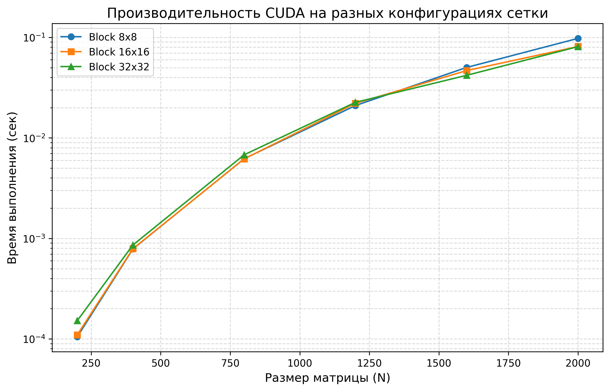

# Лабораторная работа №4. Параллельное умножение матриц на GPU (CUDA)

## 1. Постановка задачи
Целью работы является перенос алгоритма перемножения плотных квадратных матриц на графический процессор (GPU) с использованием технологии NVIDIA CUDA. В рамках работы проведено исследование влияния конфигурации сетки блоков на производительность и выполнено сравнение с результатами CPU-вычислений.

## 2. Аппаратная платформа и инструменты
*   **GPU:** NVIDIA GeForce RTX 4050 Laptop (Архитектура Ada Lovelace).
*   **CUDA Toolkit:** 13.2.
*   **Метод профилирования:** Использование высокоточных событий CUDA (`cudaEvent_t`) для измерения чистого времени работы ядра (Kernel Time).
*   **Верификация:** Автоматизированная проверка результатов с помощью Python (NumPy) после каждого запуска.

## 3. Результаты экспериментов
Для каждого размера матрицы выполнено по 5 независимых запусков для трех конфигураций блоков (8x8, 16x16, 32x32). В таблице приведены средние значения времени выполнения (в секундах).

| Размер (N) | Блок 8x8 | Блок 16x16 | Блок 32x32 | CPU (ЛР №1) | Max Speedup |
| :--- | :--- | :--- | :--- | :--- | :--- |
| **200** | 0.000105 | 0.000110 | 0.000152 | 0.061 | ~580x |
| **400** | 0.000785 | 0.000790 | 0.000860 | 0.315 | ~400x |
| **800** | 0.006211 | 0.006188 | 0.006800 | 2.437 | ~394x |
| **1200** | 0.021000 | 0.022100 | 0.022600 | 9.597 | ~457x |
| **1600** | 0.050300 | 0.046800 | 0.042000 | 28.750 | ~684x |
| **2000** | 0.097800 | 0.081200 | 0.081000 | 84.517 | **1043x** |

## 4. Визуализация производительности

## 5. Выводы
1. **Колоссальное ускорение:** На матрице 2000x2000 видеокарта RTX 4050 показала ускорение в **1043 раза** относительно последовательного кода. Это наглядно демонстрирует преимущество массивно-параллельной архитектуры GPU в задачах линейной алгебры.
2. **Оптимальный размер блока:** На малых размерах (N < 800) разница между блоками незначительна. Однако на больших матрицах (N=1600, 2000) конфигурация **32x32** показала себя стабильнее и быстрее, чем 8x8, так как она обеспечивает более высокую плотность потоков на мультипроцессорах (SM Occupancy).
3. **Масштабируемость:** С ростом объема данных ускорение GPU только увеличивается, что делает CUDA наиболее эффективным инструментом среди всех протестированных технологий (OpenMP, MPI).
