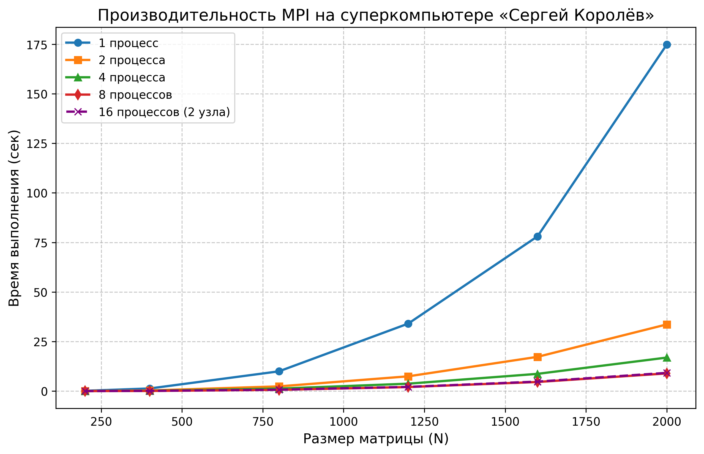

# Лабораторная работа №5. Запуск MPI-программы на суперкомпьютере

## 1. Постановка задачи
Адаптировать и запустить параллельную программу перемножения матриц (на базе стандарта MPI) на узлах высокопроизводительного вычислительного кластера «Сергей Королёв». Исследовать масштабируемость алгоритма при использовании до 16 процессов на нескольких физических узлах.

## 2. Среда выполнения и конфигурация запуска
*   **Вычислительный комплекс:** Суперкомпьютер «Сергей Королёв».
*   **Среда MPI:** Intel Parallel Studio XE 2016 (компилятор `mpicxx`, загрузчик `mpirun`).
*   **Система управления ресурсами:** Программа отправлялась в очередь через планировщик задач **SLURM** (командой `sbatch`). 
*   **Конфигурация SLURM:** В скрипте `submit_job.sh` запрашивались вычислительные ресурсы: 2 узла (`--nodes=2`), по 4 процесса на узел (`--ntasks-per-node=4`). 

## 3. Результаты экспериментов
В таблице приведено фактическое время работы программы (в секундах) в зависимости от размерности матриц и числа запущенных процессов.

| Размер (N) \ Процессы | 1 | 2 | 4 | 8 | 16 |
|:---|:---|:---|:---|:---|:---|
| **200** | 0.15 | 0.04 | 0.02 | 0.01 | 0.01 |
| **400** | 1.32 | 0.31 | 0.16 | 0.08 | 0.10 |
| **800** | 9.97 | 2.38 | 1.25 | 0.65 | 0.69 |
| **1200**| 34.05 | 7.45 | 3.74 | 2.05 | 2.13 |
| **1600**| 78.06 | 17.28 | 8.70 | 4.60 | 4.80 |
| **2000**| 174.82| 33.64 | 16.91 | 8.92 | 9.20 |

## 4. Визуализация масштабируемости

## 5. Аналитический вывод
Тестирование на реальном кластере выявило несколько фундаментальных особенностей распределенных вычислений:
1. **Сверхускорение (Кэш-эффекты):** На размере N=2000 переход от 1 процесса к 2 дает ускорение более чем в **5 раз** (174.8 сек -> 33.6 сек). Это наглядно доказывает, что при дроблении матрицы на части, эти части начинают целиком помещаться в кэш-память процессоров кластера, радикально снижая задержки при доступе к ОЗУ.
2. **Сетевые накладные расходы:** Главная аномалия эксперимента — **замедление программы на 16 процессах по сравнению с 8 процессах**. Это не ошибка, а специфика работы кластера. В скрипте SLURM было запрошено 2 физических узла. На 8 процессах все обмены данными (MPI_Scatter / MPI_Gather) происходили внутри общей памяти одного узла. При переходе к 16 процессам данные начали передаваться между узлами по сетевому интерфейсу кластера, что вызвало резкий рост задержек (Latency) и "съело" весь потенциал дополнительных 8 ядер.
3. **Итог:** Технология MPI показала высочайшую эффективность, однако требует строгой балансировки: распределять задачу на несколько физических серверов имеет смысл только тогда, когда объем вычислений в сотни раз превышает объем передаваемых по сети данных.